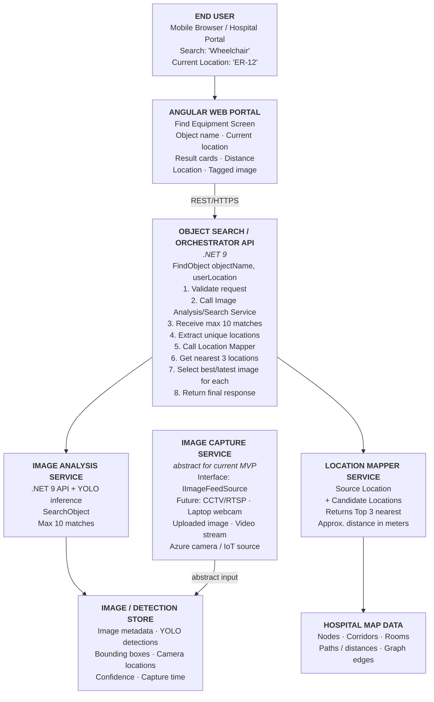
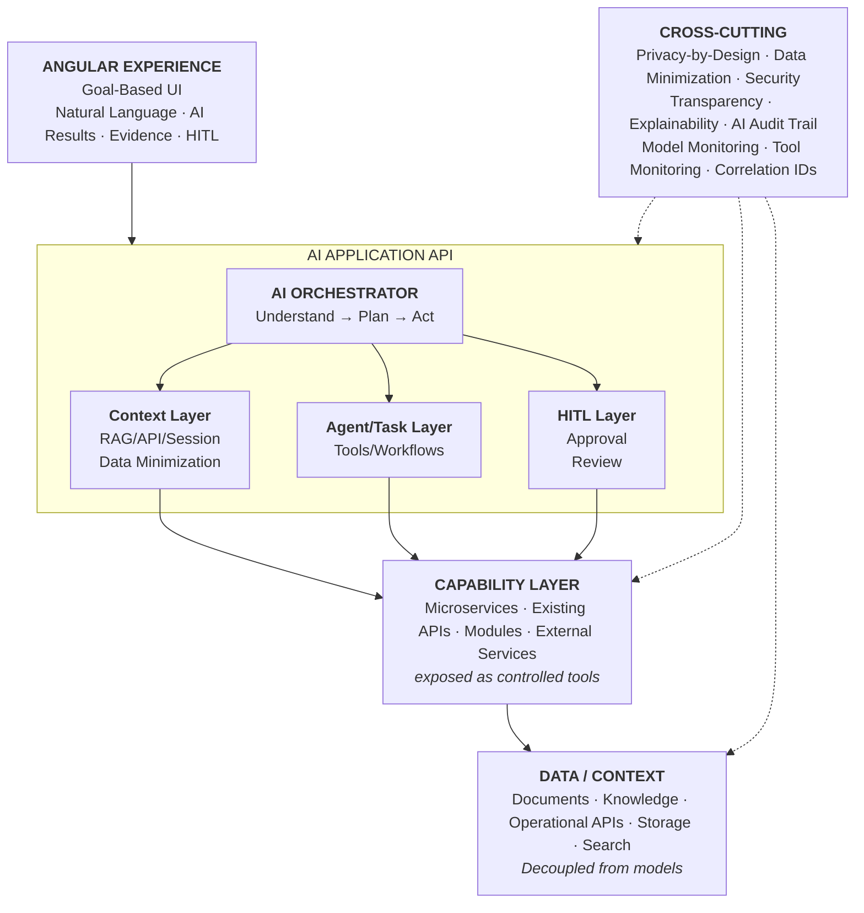

# Asset Eye — Architectural Solution Description

Hackathon MVP mapping of the two reference architecture diagrams onto what is actually
implemented in this repository.

---

## Diagram 1 — Hospital Equipment Finder (Object Search Architecture)

### Reference flow



### How this project realises it

| Reference component | MVP implementation |
|---|---|
| Angular Web Portal | `src/app` — three views: Wayfinding, Database, Feed Upload |
| Object Search Orchestrator | `src/app/pathfinding.service.ts` (`findResourcesSync`) + `GET /api/resources` |
| Image Analysis Service | `src/server-lib/` — `YoloOnnxDetectionEngine`, `preprocess`, `postprocess`, `annotate` |
| Location Mapper Service | `PathfindingService.getShortestPath` — Dijkstra over the hospital graph |
| Hospital Map Data | `src/app/mock-graph.data.ts` — `NODES` / `EDGES` (weighted graph, floors, corridors, lifts) |
| Image / Detection Store | `src/data-images/` (originals), `src/data-tagged/` (tagged image + JSON sidecar), `src/data/resources.json` |
| Abstract Image Capture | `POST /api/feed-upload` acting as the *uploaded image* implementation of the feed abstraction |

### Deliberate MVP deviations

- **Node/Express instead of .NET 9.** The reference specifies .NET 9 microservices. For
  hackathon velocity the same *logical* boundaries are implemented as TypeScript modules
  inside the existing Angular SSR server (`src/server.ts`). Each boundary is a separate
  module with its own contract, so extraction into a service later is mechanical.
- **JSON files instead of SQL Server / EF Core.** `resources.json` plus per-image JSON
  sidecars replace the `ImageCapture` / `ObjectDetection` tables.
- **Inline inference instead of a background worker.** Detection runs during the upload
  request (~200 ms) so the demo is immediate. The pipeline entry point
  (`processUpload`) is already worker-shaped and can be moved behind a queue unchanged.
- **CCTV/RTSP not implemented.** Only the uploaded-image feed exists.

### Key architectural principle preserved

YOLO inference happens **once, at ingest** — never per user search. Searches read
pre-computed detection metadata only. This is the central decision from the reference
architecture and it is honoured exactly.

```
INGEST (once per image)          SEARCH (per user request)
Upload -> YOLO -> annotate       Object + location -> filter metadata
      -> metadata + tagged jpg         -> Dijkstra -> nearest matches
```

### Detection pipeline

```
Image buffer
  -> letterbox 640x640, NCHW Float32          (preprocess.ts, sharp)
  -> onnxruntime-node session.run             (yolo-engine.ts, yolov8n.onnx)
  -> decode [1,84,8400], NMS, un-letterbox    (postprocess.ts)
  -> COCO label -> hospital label             (label-map.ts + src/data/label-map.json)
  -> SVG overlay composited by sharp          (annotate.ts)
  -> data-tagged/<id>_tagged.jpg + <id>.json  (pipeline.ts)
  -> append entry to resources.json
```

`ObjectDetectionEngine` is the abstraction boundary — the ONNX engine is swappable for a
Python sidecar or a custom-trained model without touching the pipeline, API or UI.

**Known model limitation:** `yolov8n` is COCO-trained and COCO-80 contains no `wheelchair`
class. `src/data/label-map.json` maps COCO classes onto the hospital vocabulary
(`chair -> Wheelchair`, `bed -> Stretcher`, …) so the demo reads correctly. Production
accuracy requires a custom-trained model; the raw model label is retained in every
metadata record so the mapping stays auditable.

---

## Diagram 2 — AI Application Layering

### Reference layers



### Current MVP position

| Layer | Status in this MVP |
|---|---|
| Angular Experience | **Implemented** — goal-based UI ("what are you looking for / where are you"), AI results with evidence |
| Evidence / Explainability | **Implemented** — every result shows the tagged image, bounding boxes, raw model label and confidence |
| Capability Layer | **Implemented** — detection, annotation and pathfinding are discrete, individually callable capabilities |
| Data / Context | **Implemented** — detection metadata and the map graph are stored decoupled from the model |
| AI Orchestrator (Understand -> Plan -> Act) | **Deterministic** — a fixed pipeline, not an LLM planner |
| Agent / Task Layer | **Not implemented** — no dynamic tool selection |
| HITL Layer | **Not implemented** — no approval/review step |
| Model / Tool monitoring, correlation IDs | **Not implemented** |

### Why the layering still matters now

The MVP is intentionally the bottom three layers of this diagram, built so the upper
layers can be added without rework:

- **Capabilities are already tool-shaped.** `ObjectDetectionEngine.detect()`,
  `processUpload()` and `getShortestPath()` are pure, single-purpose, typed functions —
  exactly the contract an agent layer would need to expose as tools.
- **Data is decoupled from the model.** Detection metadata is plain JSON with no model
  coupling beyond a recorded `modelVersion`, so the model can change without a data migration.
- **Evidence is captured, not reconstructed.** The tagged image and bounding boxes are
  persisted at ingest, which is what makes explainability and a future HITL review
  possible at all.

### Cross-cutting concerns — honest status

| Concern | Status |
|---|---|
| Input validation | **Done** — MIME allow-list, 10 MB cap, location validated against known nodes |
| Path-traversal safety | **Done** — client filenames are slugified, extension re-derived from validated MIME |
| Graceful degradation | **Done** — if the model is unavailable the upload still succeeds with `detectionError` |
| Explainability | **Done** — raw label + mapped label + confidence + box persisted per detection |
| Authentication | **Not implemented** — demo only |
| Retention policy / PII handling | **Not implemented** |
| Correlation IDs, audit trail, model monitoring | **Not implemented** |

Hospital imagery is sensitive. This POC detects equipment only and makes no medical or
patient-identification claims.

---

## Evolution path

```
Today                          Next                            Target
-------------------------------------------------------------------------------
Upload endpoint          ->    IImageFeedSource +         ->   CCTV / RTSP ingest
                               background worker

JSON files               ->    SQL Server + EF Core       ->   Azure SQL + Blob

TypeScript modules       ->    Separate .NET 9 services   ->   API Gateway + services
in one SSR process

Deterministic pipeline   ->    Agent/task layer over      ->   Full orchestrator
                               the same capabilities           with HITL
```

Each step is enabled by a boundary that already exists in the code, which was the point
of respecting the reference architecture's seams despite collapsing its deployment model.
